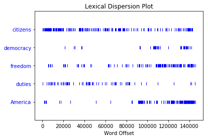

```python
import nltk
nltk.download()
```

    showing info https://raw.githubusercontent.com/nltk/nltk_data/gh-pages/index.xml
    showing info https://raw.githubusercontent.com/nltk/nltk_data/gh-pages/index.xml
    


    True


# Introduction to Natural Language Tool Kit 


```python
from nltk.book import *
```

    *** Introductory Examples for the NLTK Book ***
    Loading text1, ..., text9 and sent1, ..., sent9
    Type the name of the text or sentence to view it.
    Type: 'texts()' or 'sents()' to list the materials.
    text1: Moby Dick by Herman Melville 1851
    text2: Sense and Sensibility by Jane Austen 1811
    text3: The Book of Genesis
    text4: Inaugural Address Corpus
    text5: Chat Corpus
    text6: Monty Python and the Holy Grail
    text7: Wall Street Journal
    text8: Personals Corpus
    text9: The Man Who Was Thursday by G . K . Chesterton 1908
    


```python
text1.concordance("monstrous")
```

    Displaying 11 of 11 matches:
    ong the former , one was of a most monstrous size . ... This came towards us , 
    ON OF THE PSALMS . " Touching that monstrous bulk of the whale or ork we have r
    ll over with a heathenish array of monstrous clubs and spears . Some were thick
    d as you gazed , and wondered what monstrous cannibal and savage could ever hav
    that has survived the flood ; most monstrous and most mountainous ! That Himmal
    they might scout at Moby Dick as a monstrous fable , or still worse and more de
    th of Radney .'" CHAPTER 55 Of the Monstrous Pictures of Whales . I shall ere l
    ing Scenes . In connexion with the monstrous pictures of whales , I am strongly
    ere to enter upon those still more monstrous stories of them which are to be fo
    ght have been rummaged out of this monstrous cabinet there is no telling . But 
    of Whale - Bones ; for Whales of a monstrous size are oftentimes cast up dead u
    


```python
text1.similar("monstrous")
```

    perilous horrible imperial passing candid curious contemptible few
    uncommon maddens lazy mean careful delightfully determined tyrannical
    gamesome untoward lamentable exasperate
    


```python
text2.common_contexts(["monstrous", "very"])
#a_pretty is_pretty am_glad be_glad a_lucky
```

    a_lucky am_glad is_pretty be_glad a_pretty
    


```python
text4.dispersion_plot(["citizens", "democracy", "freedom", "duties", "America"])
```





```python
text3.generate()
```


    ---------------------------------------------------------------------------

    TypeError                                 Traceback (most recent call last)

    <ipython-input-8-463eb7c367ab> in <module>()
    ----> 1 text3.generate()
    

    TypeError: generate() missing 1 required positional argument: 'words'


```python
len(text3)
```


    44764


```python
sorted(set(text3))
```


    ['!',
     "'",
     '(',
     ')',
     ',',
     ',)',
     '.',
     '.)',
     ':',
     ';',
     ';)',
     '?',
     '?)',
     'A',
     'Abel',
     'Abelmizraim',
     'Abidah',
     'Abide',
     'Abimael',
     'Abimelech',
     'Abr',
     'Abrah',
     'Abraham',
     'Abram',
     'Accad',
     'Achbor',
     'Adah',
     'Adam',
     'Adbeel',
     'Admah',
     'Adullamite',
     'After',
     'Aholibamah',
     'Ahuzzath',
     'Ajah',
     'Akan',
     'All',
     'Allonbachuth',
     'Almighty',
     'Almodad',
     'Also',
     'Alvah',
     'Alvan',
     'Am',
     'Amal',
     'Amalek',
     'Amalekites',
     'Ammon',
     'Amorite',
     'Amorites',
     'Amraphel',
     'An',
     'Anah',
     'Anamim',
     'And',
     'Aner',
     'Angel',
     'Appoint',
     'Aram',
     'Aran',
     'Ararat',
     'Arbah',
     'Ard',
     'Are',
     'Areli',
     'Arioch',
     'Arise',
     'Arkite',
     'Arodi',
     'Arphaxad',
     'Art',
     'Arvadite',
     'As',
     'Asenath',
     'Ashbel',
     'Asher',
     'Ashkenaz',
     'Ashteroth',
     'Ask',
     'Asshur',
     'Asshurim',
     'Assyr',
     'Assyria',
     'At',
     'Atad',
     'Avith',
     'Baalhanan',
     'Babel',
     'Bashemath',
     'Be',
     'Because',
     'Becher',
     'Bedad',
     'Beeri',
     'Beerlahairoi',
     'Beersheba',
     'Behold',
     'Bela',
     'Belah',
     'Benam',
     'Benjamin',
     'Beno',
     'Beor',
     'Bera',
     'Bered',
     'Beriah',
     'Bethel',
     'Bethlehem',
     'Bethuel',
     'Beware',
     'Bilhah',
     'Bilhan',
     'Binding',
     'Birsha',
     'Bless',
     'Blessed',
     'Both',
     'Bow',
     'Bozrah',
     'Bring',
     'But',
     'Buz',
     'By',
     'Cain',
     'Cainan',
     'Calah',
     'Calneh',
     'Can',
     'Cana',
     'Canaan',
     'Canaanite',
     'Canaanites',
     'Canaanitish',
     'Caphtorim',
     'Carmi',
     'Casluhim',
     'Cast',
     'Cause',
     'Chaldees',
     'Chedorlaomer',
     'Cheran',
     'Cherubims',
     'Chesed',
     'Chezib',
     'Come',
     'Cursed',
     'Cush',
     'Damascus',
     'Dan',
     'Day',
     'Deborah',
     'Dedan',
     'Deliver',
     'Diklah',
     'Din',
     'Dinah',
     'Dinhabah',
     'Discern',
     'Dishan',
     'Dishon',
     'Do',
     'Dodanim',
     'Dothan',
     'Drink',
     'Duke',
     'Dumah',
     'Earth',
     'Ebal',
     'Eber',
     'Edar',
     'Eden',
     'Edom',
     'Edomites',
     'Egy',
     'Egypt',
     'Egyptia',
     'Egyptian',
     'Egyptians',
     'Ehi',
     'Elah',
     'Elam',
     'Elbethel',
     'Eldaah',
     'EleloheIsrael',
     'Eliezer',
     'Eliphaz',
     'Elishah',
     'Ellasar',
     'Elon',
     'Elparan',
     'Emins',
     'En',
     'Enmishpat',
     'Eno',
     'Enoch',
     'Enos',
     'Ephah',
     'Epher',
     'Ephra',
     'Ephraim',
     'Ephrath',
     'Ephron',
     'Er',
     'Erech',
     'Eri',
     'Es',
     'Esau',
     'Escape',
     'Esek',
     'Eshban',
     'Eshcol',
     'Ethiopia',
     'Euphrat',
     'Euphrates',
     'Eve',
     'Even',
     'Every',
     'Except',
     'Ezbon',
     'Ezer',
     'Fear',
     'Feed',
     'Fifteen',
     'Fill',
     'For',
     'Forasmuch',
     'Forgive',
     'From',
     'Fulfil',
     'G',
     'Gad',
     'Gaham',
     'Galeed',
     'Gatam',
     'Gather',
     'Gaza',
     'Gentiles',
     'Gera',
     'Gerar',
     'Gershon',
     'Get',
     'Gether',
     'Gihon',
     'Gilead',
     'Girgashites',
     'Girgasite',
     'Give',
     'Go',
     'God',
     'Gomer',
     'Gomorrah',
     'Goshen',
     'Guni',
     'Hadad',
     'Hadar',
     'Hadoram',
     'Hagar',
     'Haggi',
     'Hai',
     'Ham',
     'Hamathite',
     'Hamor',
     'Hamul',
     'Hanoch',
     'Happy',
     'Haran',
     'Hast',
     'Haste',
     'Have',
     'Havilah',
     'Hazarmaveth',
     'Hazezontamar',
     'Hazo',
     'He',
     'Hear',
     'Heaven',
     'Heber',
     'Hebrew',
     'Hebrews',
     'Hebron',
     'Hemam',
     'Hemdan',
     'Here',
     'Hereby',
     'Heth',
     'Hezron',
     'Hiddekel',
     'Hinder',
     'Hirah',
     'His',
     'Hitti',
     'Hittite',
     'Hittites',
     'Hivite',
     'Hobah',
     'Hori',
     'Horite',
     'Horites',
     'How',
     'Hul',
     'Huppim',
     'Husham',
     'Hushim',
     'Huz',
     'I',
     'If',
     'In',
     'Irad',
     'Iram',
     'Is',
     'Isa',
     'Isaac',
     'Iscah',
     'Ishbak',
     'Ishmael',
     'Ishmeelites',
     'Ishuah',
     'Isra',
     'Israel',
     'Issachar',
     'Isui',
     'It',
     'Ithran',
     'Jaalam',
     'Jabal',
     'Jabbok',
     'Jac',
     'Jachin',
     'Jacob',
     'Jahleel',
     'Jahzeel',
     'Jamin',
     'Japhe',
     'Japheth',
     'Jared',
     'Javan',
     'Jebusite',
     'Jebusites',
     'Jegarsahadutha',
     'Jehovahjireh',
     'Jemuel',
     'Jerah',
     'Jetheth',
     'Jetur',
     'Jeush',
     'Jezer',
     'Jidlaph',
     'Jimnah',
     'Job',
     'Jobab',
     'Jokshan',
     'Joktan',
     'Jordan',
     'Joseph',
     'Jubal',
     'Judah',
     'Judge',
     'Judith',
     'Kadesh',
     'Kadmonites',
     'Karnaim',
     'Kedar',
     'Kedemah',
     'Kemuel',
     'Kenaz',
     'Kenites',
     'Kenizzites',
     'Keturah',
     'Kiriathaim',
     'Kirjatharba',
     'Kittim',
     'Know',
     'Kohath',
     'Kor',
     'Korah',
     'LO',
     'LORD',
     'Laban',
     'Lahairoi',
     'Lamech',
     'Lasha',
     'Lay',
     'Leah',
     'Lehabim',
     'Lest',
     'Let',
     'Letushim',
     'Leummim',
     'Levi',
     'Lie',
     'Lift',
     'Lo',
     'Look',
     'Lot',
     'Lotan',
     'Lud',
     'Ludim',
     'Luz',
     'Maachah',
     'Machir',
     'Machpelah',
     'Madai',
     'Magdiel',
     'Magog',
     'Mahalaleel',
     'Mahalath',
     'Mahanaim',
     'Make',
     'Malchiel',
     'Male',
     'Mam',
     'Mamre',
     'Man',
     'Manahath',
     'Manass',
     'Manasseh',
     'Mash',
     'Masrekah',
     'Massa',
     'Matred',
     'Me',
     'Medan',
     'Mehetabel',
     'Mehujael',
     'Melchizedek',
     'Merari',
     'Mesha',
     'Meshech',
     'Mesopotamia',
     'Methusa',
     'Methusael',
     'Methuselah',
     'Mezahab',
     'Mibsam',
     'Mibzar',
     'Midian',
     'Midianites',
     'Milcah',
     'Mishma',
     'Mizpah',
     'Mizraim',
     'Mizz',
     'Moab',
     'Moabites',
     'Moreh',
     'Moreover',
     'Moriah',
     'Muppim',
     'My',
     'Naamah',
     'Naaman',
     'Nahath',
     'Nahor',
     'Naphish',
     'Naphtali',
     'Naphtuhim',
     'Nay',
     'Nebajoth',
     'Neither',
     'Night',
     'Nimrod',
     'Nineveh',
     'Noah',
     'Nod',
     'Not',
     'Now',
     'O',
     'Obal',
     'Of',
     'Oh',
     'Ohad',
     'Omar',
     'On',
     'Onam',
     'Onan',
     'Only',
     'Ophir',
     'Our',
     'Out',
     'Padan',
     'Padanaram',
     'Paran',
     'Pass',
     'Pathrusim',
     'Pau',
     'Peace',
     'Peleg',
     'Peniel',
     'Penuel',
     'Peradventure',
     'Perizzit',
     'Perizzite',
     'Perizzites',
     'Phallu',
     'Phara',
     'Pharaoh',
     'Pharez',
     'Phichol',
     'Philistim',
     'Philistines',
     'Phut',
     'Phuvah',
     'Pildash',
     'Pinon',
     'Pison',
     'Potiphar',
     'Potipherah',
     'Put',
     'Raamah',
     'Rachel',
     'Rameses',
     'Rebek',
     'Rebekah',
     'Rehoboth',
     'Remain',
     'Rephaims',
     'Resen',
     'Return',
     'Reu',
     'Reub',
     'Reuben',
     'Reuel',
     'Reumah',
     'Riphath',
     'Rosh',
     'Sabtah',
     'Sabtech',
     'Said',
     'Salah',
     'Salem',
     'Samlah',
     'Sarah',
     'Sarai',
     'Saul',
     'Save',
     'Say',
     'Se',
     'Seba',
     'See',
     'Seeing',
     'Seir',
     'Sell',
     'Send',
     'Sephar',
     'Serah',
     'Sered',
     'Serug',
     'Set',
     'Seth',
     'Shalem',
     'Shall',
     'Shalt',
     'Shammah',
     'Shaul',
     'Shaveh',
     'She',
     'Sheba',
     'Shebah',
     'Shechem',
     'Shed',
     'Shel',
     'Shelah',
     'Sheleph',
     'Shem',
     'Shemeber',
     'Shepho',
     'Shillem',
     'Shiloh',
     'Shimron',
     'Shinab',
     'Shinar',
     'Shobal',
     'Should',
     'Shuah',
     'Shuni',
     'Shur',
     'Sichem',
     'Siddim',
     'Sidon',
     'Simeon',
     'Sinite',
     'Sitnah',
     'Slay',
     'So',
     'Sod',
     'Sodom',
     'Sojourn',
     'Some',
     'Spake',
     'Speak',
     'Spirit',
     'Stand',
     'Succoth',
     'Surely',
     'Swear',
     'Syrian',
     'Take',
     'Tamar',
     'Tarshish',
     'Tebah',
     'Tell',
     'Tema',
     'Teman',
     'Temani',
     'Terah',
     'Thahash',
     'That',
     'The',
     'Then',
     'There',
     'Therefore',
     'These',
     'They',
     'Thirty',
     'This',
     'Thorns',
     'Thou',
     'Thus',
     'Thy',
     'Tidal',
     'Timna',
     'Timnah',
     'Timnath',
     'Tiras',
     'To',
     'Togarmah',
     'Tola',
     'Tubal',
     'Tubalcain',
     'Twelve',
     'Two',
     'Unstable',
     'Until',
     'Unto',
     'Up',
     'Upon',
     'Ur',
     'Uz',
     'Uzal',
     'We',
     'What',
     'When',
     'Whence',
     'Where',
     'Whereas',
     'Wherefore',
     'Which',
     'While',
     'Who',
     'Whose',
     'Whoso',
     'Why',
     'Wilt',
     'With',
     'Woman',
     'Ye',
     'Yea',
     'Yet',
     'Zaavan',
     'Zaphnathpaaneah',
     'Zar',
     'Zarah',
     'Zeboiim',
     'Zeboim',
     'Zebul',
     'Zebulun',
     'Zemarite',
     'Zepho',
     'Zerah',
     'Zibeon',
     'Zidon',
     'Zillah',
     'Zilpah',
     'Zimran',
     'Ziphion',
     'Zo',
     'Zoar',
     'Zohar',
     'Zuzims',
     'a',
     'abated',
     'abide',
     'able',
     'abode',
     'abomination',
     'about',
     'above',
     'abroad',
     'absent',
     'abundantly',
     'accept',
     'accepted',
     'according',
     'acknowledged',
     'activity',
     'add',
     'adder',
     'afar',
     'afflict',
     'affliction',
     'afraid',
     'after',
     'afterward',
     'afterwards',
     'aga',
     'again',
     'against',
     'age',
     'aileth',
     'air',
     'al',
     'alive',
     'all',
     'almon',
     'alo',
     'alone',
     'aloud',
     'also',
     'altar',
     'altogether',
     'always',
     'am',
     'among',
     'amongst',
     'an',
     'and',
     'angel',
     'angels',
     'anger',
     'angry',
     'anguish',
     'anointedst',
     'anoth',
     'another',
     'answer',
     'answered',
     'any',
     'anything',
     'appe',
     'appear',
     'appeared',
     'appease',
     'appoint',
     'appointed',
     'aprons',
     'archer',
     'archers',
     'are',
     'arise',
     'ark',
     'armed',
     'arms',
     'army',
     'arose',
     'arrayed',
     'art',
     'artificer',
     'as',
     'ascending',
     'ash',
     'ashamed',
     'ask',
     'asked',
     'asketh',
     'ass',
     'assembly',
     'asses',
     'assigned',
     'asswaged',
     'at',
     'attained',
     'audience',
     'avenged',
     'aw',
     'awaked',
     'away',
     'awoke',
     'back',
     'backward',
     'bad',
     'bade',
     'badest',
     'badne',
     'bak',
     'bake',
     'bakemeats',
     'baker',
     'bakers',
     'balm',
     'bands',
     'bank',
     'bare',
     'barr',
     'barren',
     'basket',
     'baskets',
     'battle',
     'bdellium',
     'be',
     'bear',
     'beari',
     'bearing',
     'beast',
     'beasts',
     'beautiful',
     'became',
     'because',
     'become',
     'bed',
     'been',
     'befall',
     'befell',
     'before',
     'began',
     'begat',
     'beget',
     'begettest',
     'begin',
     'beginning',
     'begotten',
     'beguiled',
     'beheld',
     'behind',
     'behold',
     'being',
     'believed',
     'belly',
     'belong',
     'beneath',
     'bereaved',
     'beside',
     'besides',
     'besought',
     'best',
     'betimes',
     'better',
     'between',
     'betwixt',
     'beyond',
     'binding',
     'bird',
     'birds',
     'birthday',
     'birthright',
     'biteth',
     'bitter',
     'blame',
     'blameless',
     'blasted',
     'bless',
     'blessed',
     'blesseth',
     'blessi',
     'blessing',
     'blessings',
     'blindness',
     'blood',
     'blossoms',
     'bodies',
     'boldly',
     'bondman',
     'bondmen',
     'bondwoman',
     'bone',
     'bones',
     'book',
     'booths',
     'border',
     'borders',
     'born',
     'bosom',
     'both',
     'bottle',
     'bou',
     'boug',
     'bough',
     'bought',
     'bound',
     'bow',
     'bowed',
     'bowels',
     'bowing',
     'boys',
     'bracelets',
     'branches',
     'brass',
     'bre',
     'breach',
     'bread',
     'breadth',
     'break',
     'breaketh',
     'breaking',
     'breasts',
     'breath',
     'breathed',
     'breed',
     'brethren',
     'brick',
     'brimstone',
     'bring',
     'brink',
     'broken',
     'brook',
     'broth',
     'brother',
     'brought',
     'brown',
     'bruise',
     'budded',
     'build',
     'builded',
     'built',
     'bulls',
     'bundle',
     'bundles',
     'burdens',
     'buried',
     'burn',
     'burning',
     'burnt',
     'bury',
     'buryingplace',
     'business',
     'but',
     'butler',
     'butlers',
     'butlership',
     'butter',
     'buy',
     'by',
     'cakes',
     'calf',
     'call',
     'called',
     'came',
     'camel',
     'camels',
     'camest',
     'can',
     'cannot',
     'canst',
     'captain',
     'captive',
     'captives',
     'carcases',
     'carried',
     'carry',
     'cast',
     'castles',
     'catt',
     'cattle',
     'caught',
     'cause',
     'caused',
     'cave',
     'cease',
     'ceased',
     'certain',
     'certainly',
     'chain',
     'chamber',
     'change',
     'changed',
     'changes',
     'charge',
     'charged',
     'chariot',
     'chariots',
     'chesnut',
     'chi',
     'chief',
     'child',
     'childless',
     'childr',
     'children',
     'chode',
     'choice',
     'chose',
     'circumcis',
     'circumcise',
     'circumcised',
     'citi',
     'cities',
     'city',
     'clave',
     'clean',
     'clear',
     'cleave',
     'clo',
     'closed',
     'clothed',
     'clothes',
     'cloud',
     'clusters',
     'co',
     'coat',
     'coats',
     'coffin',
     'cold',
     ...]


```python
len(set(text3))
```


    2789


```python
len(set(text3)) / len(text3)
```


    0.06230453042623537


```python
text3.count("smote")
```


    5


```python
100 * text4.count('a') / len(text4)
```


    1.4643016433938312


```python
def lexical_diversity(text):
...     return len(set(text)) / len(text)
```


```python

```
